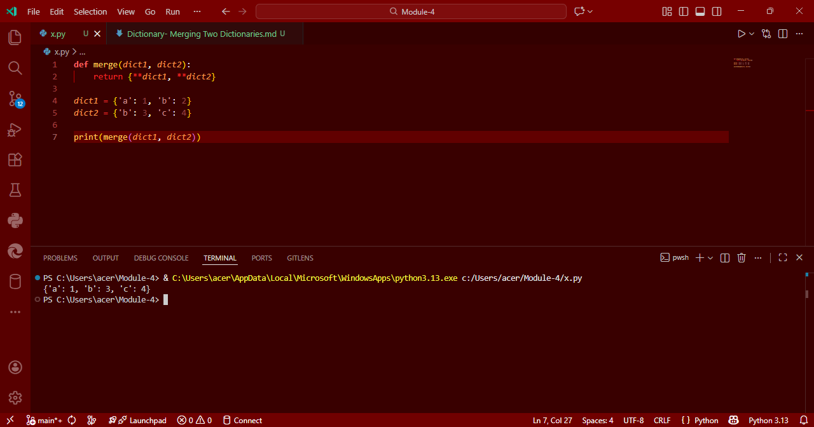

## Dictionary Operations in Python: Merging Two Dictionaries

## Aim
To write a Python program that merges **two dictionaries** and combines their key-value pairs.

## Algorithm
1. Define two dictionaries `dict1` and `dict2` with some key-value pairs.
2. Define a function `merge()` that merges the two dictionaries using the `**` unpacking operator.
   - The merged result will combine keys from both dictionaries. If a key exists in both, the value from `dict2` will overwrite that from `dict1`.
3. Call the `merge()` function and print the merged dictionary.

## Program
```
def merge(dict1, dict2):
    return {**dict1, **dict2}

dict1 = {'a': 1, 'b': 2}
dict2 = {'b': 3, 'c': 4}

print(merge(dict1, dict2))
```

## Output


## Result
Thus, the Python program to merge two dictionaries using the unpacking operator is executed successfully