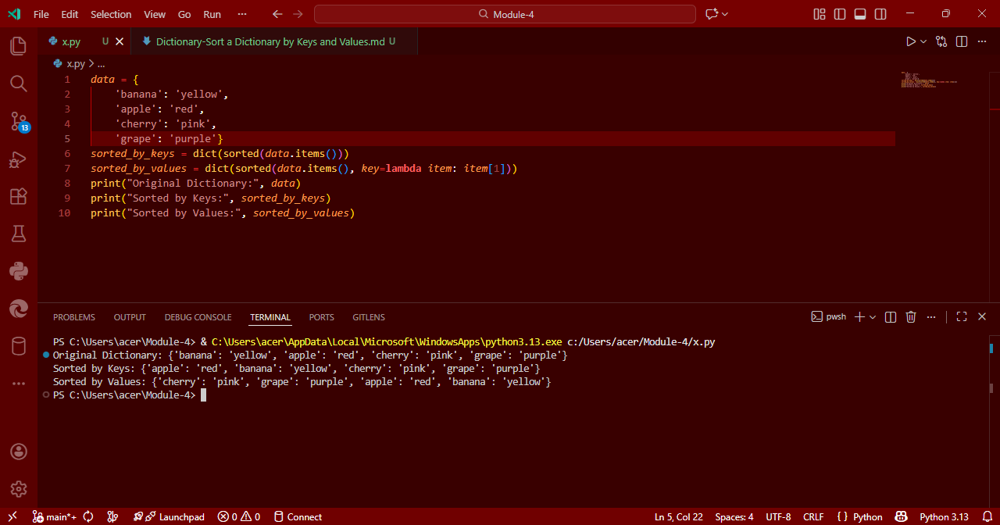

# Dictionary-Python Program to Sort a Dictionary by Keys and Values

This Python program demonstrates how to sort a dictionary:
- Alphabetically by keys
- Alphabetically by values

---

## Aim

To write a Python program that sorts a dictionary's:
- Keys in alphabetical order
- Values in alphabetical order

---

## Algorithm

1. **Start the program.**
2. **Define** a dictionary with key-value pairs.
3. **Sort by Keys**:
   - Use `sorted(dictionary.items())`
   - Convert the result to a dictionary using `dict()`
4. **Sort by Values**:
   - Use `sorted(dictionary.items(), key=lambda item: item[1])`
   - Convert the result to a dictionary using `dict()`
5. **Display** the original and sorted dictionaries.
6. **End the program.**

---

## Program
```
data = {
    'banana': 'yellow',
    'apple': 'red',
    'cherry': 'pink',
    'grape': 'purple'}
sorted_by_keys = dict(sorted(data.items()))
sorted_by_values = dict(sorted(data.items(), key=lambda item: item[1]))
print("Original Dictionary:", data)
print("Sorted by Keys:", sorted_by_keys)
print("Sorted by Values:", sorted_by_values)
```

## Sample Output


## Result
Thus, the Python program to sort a dictionary by keys and by values is executed successfully.
