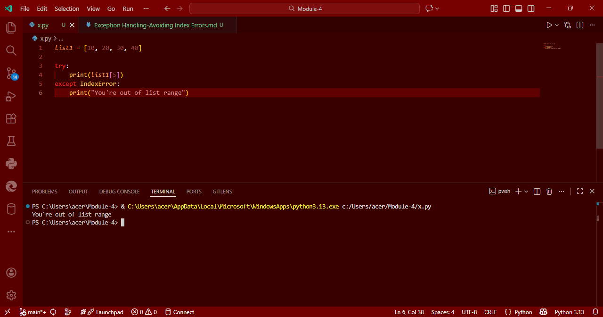

# Exception Handling in Python: Avoiding Index Errors

## Aim
To write a Python program that handles an **IndexError** when trying to access an element beyond the available range of a list.

## Algorithm
1. Define a list `list1` with some integer elements.
2. Use a **try-except** block:
   - In the `try` block, attempt to access an index that is out of range (e.g., `list1[5]`).
   - In the `except` block, catch the error and print a custom message `"You're out of list range"`.
3. Print the result based on whether the index access succeeds or fails.

## Program
```
list1 = [10, 20, 30, 40]

try:
    print(list1[5])
except IndexError:
    print("You're out of list range")
```

## Output


## Result
Thus, the Python program successfully handles an IndexError using exception handling.